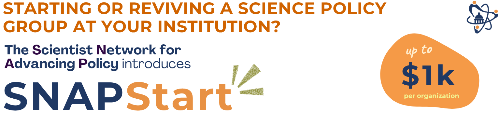

<a class="btn btn-primary btn-lg" href="https://docs.google.com/forms/d/e/1FAIpQLScYbpKdnijGTR8lUmYuma078NWxOhZvV5s-KrHyzsM7ZqZDNQ/viewform?usp=header" target="_blank" rel="noopener">Apply Now!</a>

## What is SNAPStart?

SNAPStart is a new mini-grant program organized by the Scientist Network for Advancing Policy (SNAP) designed to help new student science policy organizations build momentum and get off to a quick start! Each mini-grant provides a general-purpose fund of up to $1000 to support food at events, promotional materials, speaker honoraria, and other expenses needed to help your group build momentum and recruit new members.

## Why SNAPStart?

Science policy student organizations are an essential part of the science policy ecosystem, training students who will become science policy fellows and professionals, as well as those who will remain in academia or industry and continue to contribute vital work to the science policy and communication space. Indeed, for many SNAP members, our first introduction to science policy came through science policy student groups at our own institutions.

However, the majority of universities around the United States currently do not have science policy student groups, and those that do tend to be wealthier institutions with more funding available to support them. SNAPStart aims to change that by providing a one-time start-up fund that new and revived groups can use as they're getting underway, with the hope that the initial events supported by the grant can be used to apply for more stable funding in future years.

## Commitments of Mini-Grant Recipients

All actions and events must be completed and reported on within 12 months of receiving the grant. Activities should be documented through a write-up, along with relevant photos, videos, web links, and/or social media.

Recipients may also be invited to share lessons learned with fellow early-career scientists through avenues such as guest blog posts, online trainings, or other platforms.

## How to Apply

Apply now through **August 31, 2026** through [this form](https://docs.google.com/forms/d/e/1FAIpQLScYbpKdnijGTR8lUmYuma078NWxOhZvV5s-KrHyzsM7ZqZDNQ/viewform?usp=header). For any questions regarding your application, please contact SNAP at [snapscipolorg@gmail.com](mailto:snapscipolorg@gmail.com).

## FAQ

- **Who is Eligible for SNAPStart?**
  - Any student organization founded or restarted after a hiatus within the previous two years at the time of application!
  - Undergraduate and graduate student groups are eligible.
- **What can the Mini-Grant funds be used for?**
  - The use of the fund is entirely at the discretion of the recipient, but must support their science policy student group in some way. Examples of how the grant could be spent include:
    - Food to incentivize event attendance
    - Promotional materials such as flyers and posters
    - Speaker honoraria
    - Travel expenses to bring members to a science policy conference
    - Fees paid for enrollment in a sci pol course for members
- **When are applications due?**
  - The deadline for our first funding cycle is August 31, 2026. We anticipate holding another funding cycle in winter.
- **How much money can my group receive through this mini-grant?**
  - Grants can award up to $1,000.
- **Does my organization need to have representation in SNAP to be eligible for this grant program?**
  - No, though we certainly encourage you to [join](https://docs.google.com/forms/d/e/1FAIpQLScBfsc62aqefilfjhyTRLAwjU4jPsyk434IagRqKWIkcwH-PA/viewform?usp=header)! All student organizations, with and without SNAP representation, are eligible.
- **How will grants be evaluated?**
  - Applications will be evaluated primarily by the following criteria, as detailed on [this rubric](https://docs.google.com/document/d/e/2PACX-1vS8K_FG8LKcMZgHoTWhf2P5d8kMCOiz0Q42LQSuep-rTw5eBuTLJvtwWNavkkOCMg/pub):
    - Intended use of grant funds
    - Plan for organizational growth and stability
    - Applicant leadership and management
    - Degree of financial need/lack of existing institutional support
    - Commitment to community outreach or partnership
  - All applications will be evaluated by SNAP reviewers, who must declare any potential conflicts of interest.
- **If I apply for this program, will I be eligible to apply again in the future?**
  - If you apply and are not awarded a mini-grant, you are absolutely welcome to apply again in the future as long as your organization was founded or restarted within two years of the application deadline!
  - If you apply for and receive a mini-grant, you may apply again, up to a lifetime maximum of $1,000 through this program, provided your organization was still founded/restarted within two years of the application deadline.
- **Can I apply for this program to support a science policy group that is not housed at a university, or that does not cater exclusively to students?**
  - SNAPStart is primarily intended to support student groups at colleges and universities, but we encourage you to contact [snapscipolorg@gmail.com](mailto:snapscipolorg@gmail.com) with the specific details of your situation.
- **Where does the funding come from?**
  - The SNAPStart mini-grant program is generously supported by the [Gordon and Betty Moore Foundation](https://www.moore.org).
