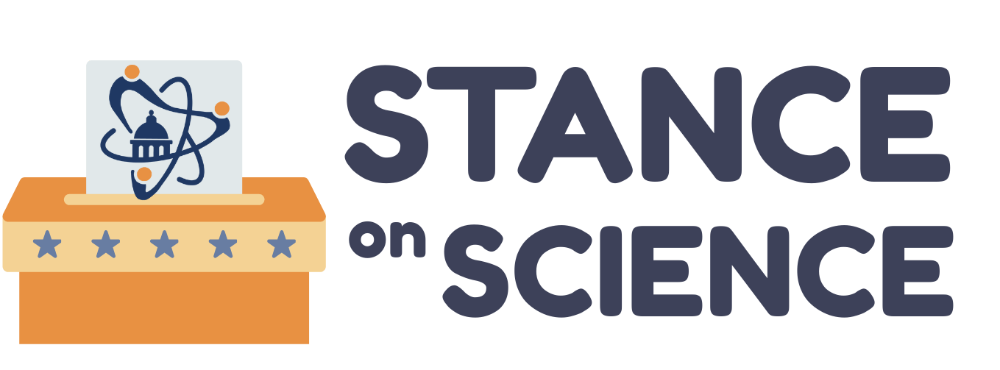

<!--
  /initiatives/stance-on-science/ is rendered by
  src/pages/initiatives/stance-on-science.astro, not from this file. Only the
  frontmatter above is used — it supplies the card on the /initiatives/ index.
  The body below is the original migrated copy, kept for reference; edits to it
  will NOT change the live page.
-->

## About Stance on Science

Science affects every part of our daily lives—from the safety of our food and water, to the health of our communities, to the jobs and technologies that power our future. Yet too often, science is left out of political debates.

SNAP is launching a new initiative for the 2026 elections to change that. Our goals are to:

1. Show candidates that science matters by directly asking where they stand on pressing science policy-related issues.
2. Provide voters with clear, accessible information so they can see which candidates value science in decision-making.
3. Hold candidates accountable by sharing their responses publicly on our website and via local media.
4. Encourage thoughtful engagement between communities and policymakers on science policy-related policies.

### How It Works

Individual state teams will send political candidates a set of science policy-related (and state-specific) questions and ask for written responses. Their answers will be posted publicly on our website so that voters can easily compare positions.

*The responses shared by candidates do not reflect the views of the Stance state teams nor SNAP. SNAP is a non-partisan organization. SNAP and the Stance state teams do not endorse any candidates.*

Some, but not all, of the states will be evaluating candidate answers with the publicly available grading rubric (which you can access [here](https://docs.google.com/document/d/1HFpqoIsq8DpBhChrxs-jU6NXkgSFmi7FEaasIwx6oKU/edit?usp=sharing)). The evaluations are intended to assist constituents as they interpret candidates' stances. The rubric is based on the following criteria:

- Evidence-Based positions: this candidate regularly cites scientific findings as the basis for their policy goals (ends)
- Sound policy-making: this candidate cites or pledges to utilize scientific findings or expertise in the design of their policies (means)
- Thoroughness of Response: this candidate provides a well-thought-out, detailed response to this question

To find out if your state is evaluating responses, check out the individual state pages. Teams will not be modifying candidate responses in any way.

Additionally, some states are organizing local town halls where candidates for office can answer questions about their Stance on Science for the public directly.

### Why This Matters

By highlighting candidates' views on science, SNAP and local state teams aim to elevate science as a key part of the political conversation and remind candidates that voters care about evidence-based leadership.

### How to Get Involved

If you'd like to support this initiative, [fill out our interest form](https://docs.google.com/forms/d/e/1FAIpQLSem6bVuZnK7eWls-CTMpxWxaxHpuElNj4oOXIvLkgDYRO6YNg/viewform?usp=header) and we'll be in touch! There are opportunities for everyone—whether you're ready to help lead outreach in your state or make a few calls or send emails to political candidates. Every contribution helps hold our political candidates accountable and strengthens our collective voice.
